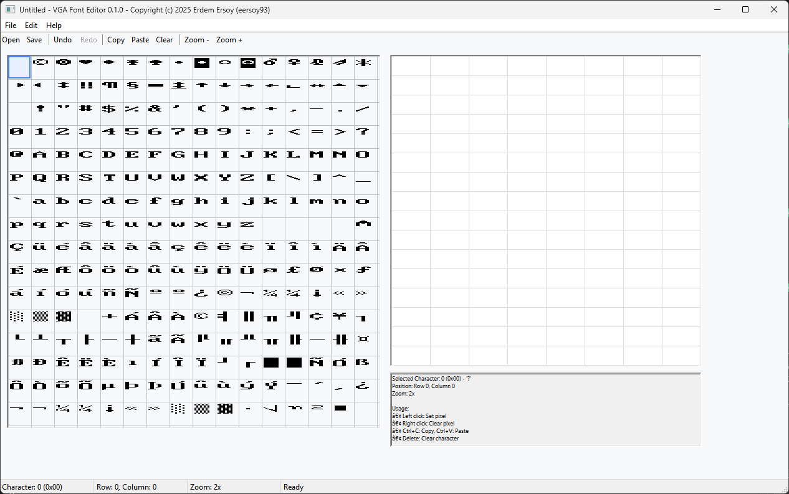

# VGA Font Editor



A modern VGA text mode font editor for Windows, written in C using Windows API. Written with Cursor AI.

## Features

### 🎨 Font Editing
- Edit 8x16 pixel VGA fonts (256 characters)
- Visual character grid displaying all 256 characters
- Pixel-level character editor
- Mouse and keyboard support for pixel editing
- Character selection and navigation

### 🖥️ Modern Interface
- Modern UI design (Material Design-like colors)
- Visual Styles and DPI awareness support
- Hover effects and smooth selection highlights
- Responsive design with clean appearance
- Enhanced user experience with toolbar and status bar

### 📁 File Support
- **Reading**: VGAF format (.vgaf) - Editor's native format
- **Saving**: VGAF format (.vgaf) - Editor's native format, C header file (.h)
- Automatic file format detection

### ⚡ Editor Features
- **Undo/Redo system** (20 levels)
- **Character copy/paste** (Ctrl+C/V)
- **Zoom support** (1x-2x magnification)
- **Keyboard shortcuts** (Ctrl+O, Ctrl+S, Delete, etc.)
- **Auto-save warnings**
- **File change tracking**

### 🎯 Usability Features
- Drag & drop for multi-pixel editing
- Real-time character preview
- Detailed information display in status bar
- Quick access buttons in toolbar

## System Requirements

### Prerequisites
- **MinGW-w64 UCRT** (with gcc and windres)
- **Make** (optional, for using Makefile)
- **Windows 10** or newer (UCRT requirement)
- **Visual C++ Redistributable** (for theming support)

### Supported Platforms
- Windows 10/11 (due to UCRT requirements)
- 32-bit and 64-bit architectures
- DPI scaling support (High-DPI displays)

## Building

This project is designed to be compiled with MinGW-w64 UCRT. Make sure MinGW-w64 UCRT is installed on your system and added to PATH.

> **Note**: Due to UCRT (Universal C Runtime) usage, the compiled program only runs on Windows 10 and newer versions.

### Building with Makefile:
```bash
# Standard build
make

# Debug version
make debug

# Release version (optimized)
make release

# Clean
make clean

# Help
make help
```

### Manual Building:
```bash
# Compile resource file
windres -i resource.rc -o resource.o

# Compile C files
gcc -Wall -Wextra -std=c99 -O2 -c main.c -o main.o
gcc -Wall -Wextra -std=c99 -O2 -c font_manager.c -o font_manager.o
gcc -Wall -Wextra -std=c99 -O2 -c controls.c -o controls.o

# Create executable
gcc -mwindows -o vga-font-editor.exe main.o font_manager.o controls.o resource.o -lgdi32 -luser32 -lkernel32 -lcomdlg32 -lcomctl32 -luxtheme -ldwmapi
```

## Usage Guide

### 1. Character Selection
- Click on any character in the grid (left panel) to select it for editing
- Selected character is highlighted with blue background
- Characters under mouse cursor are shown with light gray background

### 2. Pixel Editing
- **Left click**: Set pixels (black)
- **Right click**: Clear pixels (white)
- **Dragging**: Multi-pixel editing by holding mouse button
- **Zoom**: Use + and - buttons in toolbar for zoom in/out

### 3. Keyboard Shortcuts
- `Ctrl+O`: Open font file
- `Ctrl+S`: Save font file
- `Ctrl+C`: Copy character
- `Ctrl+V`: Paste character
- `Ctrl+Z`: Undo
- `Ctrl+Y`: Redo
- `Delete/Backspace`: Clear character
- `F1`: About dialog

### 4. File Operations
- **File → Open**: Load various VGA font formats (VGAF, PSF1/PSF2, Raw binary)
- **File → Save**: Save font in VGAF format
- **Export**: C header file export (planned feature)
- File format is automatically detected and shown in status bar
- Unsaved changes are indicated with "*" in window title

## File Formats

### VGAF (VGA Font Editor Format)
Editor's native format:
- **16-byte header**: Format identification and metadata
- **4096 bytes font data**: 256 characters × 16 bytes
- **Total file size**: 4112 bytes
- **Character size**: 8 pixels width × 16 pixels height
- **Data structure**: Each byte represents one pixel row (MSB = leftmost pixel)

### Supported Reading Formats
- **Raw Binary**: Raw VGA font data (4096 bytes)

### Saving and Export
- **VGAF (.vgaf)**: Editor's native format (saving)
- **C Header (.h)**: Export font data as C array (planned feature)

## Character Set

The editor supports the full PC/VGA character set (0-255):
- **0-31**: Control characters and symbols
- **32-126**: Standard ASCII printable characters  
- **127-255**: Extended ASCII and graphics characters

## Technical Details

### Architecture
- **Language**: C99 standard
- **GUI Framework**: Win32 API
- **Graphics**: GDI (Graphics Device Interface)
- **Theming**: Modern appearance with UxTheme API
- **Controls**: Common Controls 6.0

### Performance Optimizations
- Efficient pixel rendering
- Redrawing only changed areas
- Memory management optimizations
- Responsive UI updates

### Modern UI Features
- Material Design color palette
- Smooth hover animations
- High-DPI support
- Visual styles integration
- Consistent spacing and typography

## Development

### Code Structure
```
vga-font-editor/
├── main.c              # Main program and window management
├── font_manager.c      # Font loading/saving and data processing
├── controls.c          # Custom UI controls
├── vga_font_editor.h   # Header file and definitions
├── resource.rc         # Windows resources
├── vga_font_editor.manifest # Modern UI manifest
└── Makefile           # Build automation
```

### Contributing
Bug reports and enhancement requests are welcome!

1. Fork the project
2. Create a feature branch (`git checkout -b feature/new-feature`)
3. Commit your changes (`git commit -am 'Add new feature'`)
4. Push to the branch (`git push origin feature/new-feature`)
5. Create a Pull Request

## License

Copyright (c) 2025 Erdem Ersoy (eersoy93)

This project is licensed under the GPLv3 License - see the LICENSE file for details.

## Version History

### v0.1.0 (Current)
- ✅ Basic VGA font editing
- ✅ Modern UI design
- ✅ Undo/Redo system
- ✅ Multiple file format support
- ✅ Enhanced keyboard shortcuts
- ✅ Zoom and toolbar features
- ✅ DPI awareness support
